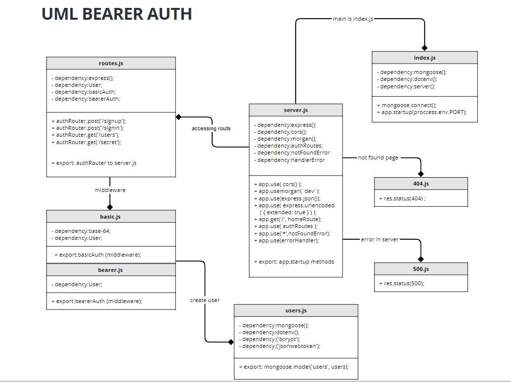

# bearer-auth

## LAB - 07
## **Deployment Test**
## **Author: Farah AlWahaibi**
[PR LINK](https://github.com/jdeitawimostafa/bearer-auth/pull/1)
[Heroku APP]()
[Report Test](https://github.com/jdeitawimostafa/bearer-auth/actions)
## **Installation**
* **dependencies :**
  * "@code-fellows/supergoose"
  * "base-64"
  * "bcrypt"
  * "cors"
  * "dotenv"
  * "express"
  * "jsonwebtoken"
  * "mongoose"
  * "morgan"
* **devDependencies :**
  * eslint"
  * "jest"
  * "supertest"
## **Setup**
* .env requirements
  * **PORT** - 3000
  * **MONGOOSE_URI**
  * **SECRET** - used to create jwt
## **Running the app**
* **npm start**
* **Endpoints:**
   *
   *  for create (/signup)
   *  for login (/signin)
   *  for get (/users)
   *  for get (/secret)
## **Tests**
* **Unit Tests:** npm run test (tests for server, routes, and user model currently implemented):
  * Auth Middleware
    * user authentication
      * ✓ fails a login for a user (admin) with the incorrect basic credentials 
      * ✓ logs in an admin user with the right credentials 
  * Auth Router
    * admin users
      * ✓ can create one 
      * ✓ can signin with basic 
      * ✓ can signin with bearer 
    * bad logins
      * ✓ basic fails with known user and wrong password 
      * ✓ basic fails with unknown user 
      * ✓ bearer fails with an invalid token 
      * ✓ basic fails with known user and wrong password  
      * ✓ basic fails with unknown user 
      * ✓ bearer fails with an invalid token 
      * ✓ basic fails with known user and wrong password  
      * ✓ basic fails with unknown user 
      * ✓ bearer fails with an invalid token 
    * editor users
      * ✓ can create one 
      * ✓ can signin with basic 
      * ✓ can signin with bearer 
    * user users
      * ✓ can create one 
      * ✓ can signin with basic 
      * ✓ can signin with bearer 
  * Auth Middleware
    * user authentication
      * ✓ fails a login for a user (admin) with an incorrect token 
      * ✓ logs in a user with a proper token
* **Lint Tests:** npm run lint
***
## **UML Diagram**

***Thank you!!***
